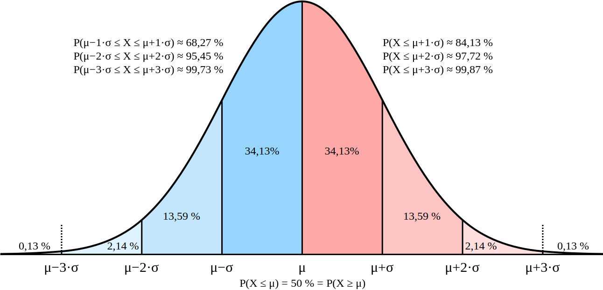

# Choices

Imagine that you had to pick something out of a finite pool of candidates. You know the size of the pool, but you can only inspect the candidates one at a time, and for every candidate, you can choose to go with it, or move on to the next candidate. You can't go back to candidates you've already seen.

What is the best strategy for finding the optimal candidate? I've seen an educational video explaining that the best strategy is passing up on the first third of candidates, no matter how good, but noting the best candidate you have seen thus far. After that, you pick the one candidate that is as good or better as the one you have seen in the first third. That strategy makes sense, but is it really optimal in practise?

To find out, I've written this tool. The idea is that we can express the quality of the candidate as a number. That is not necessarily true, but it works for this model. The distribution of the qualities of the candidates is very likely to follow a normal distribution, because most candidates will be close to average, and there are fewer at the extreme ends.



In order for it to be comprehensible, I chose a mean quality of 100, and a standard deviation of 15. That mimicks how TQ scores are expressed, but it should represent an arbitrary measurement of quality. It is easier to reason about it, because it follows that any candidate with a score higher than 100 is better than the average, and a score lower than 100 is worse than the average, and the more points above 100 the candidate that was picked has, the better quality the choice was.

I have modelled the algorithm as such. I use the `rand_dist` crate to create floating-point numbers following a normal distribution. The amount of candidates that is skipped initially is given as a percentage by `opt.skip`, as a value between zero and one, with zero meaning that no candidates are skipped and the first candidate that is encountered being chosen, and 0.5 meaning that the first half of all candidates are skipped.

It finds out what the best rating of all the skipped candidates is, and then it goes through the remaining candidates, choosing the next one that is better than the last maximum, or failing that, it chooses the last possible candidate.

```rust
fn run(opt: &Opt) -> anyhow::Result<f64> {
    let mut rng = thread_rng();
    let normal = Normal::new(opt.mean, opt.dev)?;

    // how many choices are we just gonna skip?
    let skip_amount = (opt.choices as f64 * opt.skip).floor() as usize;

    // in the values that we skipped, what was the highest?
    let skip_max = normal
        .sample_iter(rng)
        .take(skip_amount)
        .fold(0./0., f64::max);

    // how many choices can we make?
    let choices = opt.choices - skip_amount - 1;

    // choose the next item that is better than the best we had
    let choice = normal
        .sample_iter(rng)
        .take(choices)
        .find(|n| *n > skip_max);

    let last = normal.sample(&mut rng);

    // if we didn't find any, take whatever was the last one.
    let choice = choice
        .unwrap_or(last);

    Ok(choice)
}
```

This process is repeated, and the chosen qualities are collected, and their averages and standard deviations calculated. It is also possible to use multithreading to speed up the simulation. As expected, when using a skip value of zero (meaning that the first candidate is always chosen), the mean and standard deviation are exactly that of the candidates.

```
$ cargo run -- --runs 100000 --threads 16 --skip 0
mean = 99.93834171289204 deviation = 15.011669673882675
```

If we now set it to skip the first 10% of all candidates, it is apparent that the resulting choices are of higher-than-average quality. This reinforces that the method does indeed work.

```
$ cargo run -- --runs 100000 --threads 16 --skip 0
mean = 125.5315883592023 deviation = 12.71500937085989
```

It can also be seen that the standard deviation is lower, meaning that it more consistently gets good results. That is a good thing. However, following the advice from the educational video, which was to skip the first third of all candidates, does not produce better results than this.

```
$ cargo run -- --runs 100000 --threads 16 --skip 0.33
mean = 122.7231486769789 deviation = 19.084099642429788
```

As can be seen, this shows that the average candidate quality is lower (122.7 rather than 125.5) and the standard deviation is higher, meaning that the results are all over the place. It seems like the method is good, but the choice of one-third is not ideal. In testing I have found that a value of around 15% seems to produce the best results.

```
$ cargo run -- --runs 100000 --threads 16 --skip 0.15
mean = 125.8500505452881 deviation = 14.441990231009402
```

The number of choices is also a factor, in all of these cases there are 100 candidates, but this number as well as all of the other settings can be tweaked and explored. 
